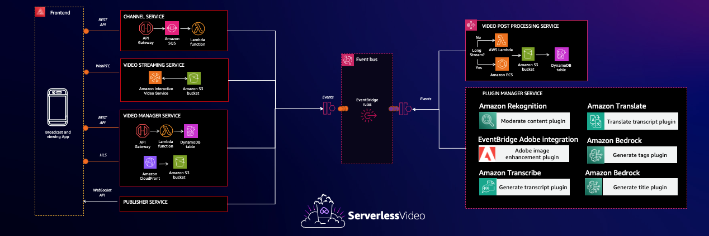

# serverlessVideo: A Serverless and Event-Driven Video Streaming Application

## Introduction

Welcome to the serverlessVideo readme! This comprehensive guide explores the event-driven video streaming application called [serverlessVideo](https://video.serverlessland.com/). [serverlessVideo](https://video.serverlessland.com/) is a best practices example of a cost-effective serverless video streaming application built on a microservices architecture.

[serverlessVideo](https://video.serverlessland.com) enables AWS users to broadcast live video content directly from their cell phones. At the same time, viewers can access live streams and watch on-demand videos. Additionally, serverlessVideo encourages serverless developers to extend the application's functionality by creating [custom plugins](https://github.com/aws-samples/serverless-video-streaming/tree/main/plugins) that hook into the application's event driven architecure.

###  Custom Plugins and Extensibility

A standout feature of serverlessVideo is its extensibility through [custom plugins](https://github.com/aws-samples/serverless-video-streaming/tree/main/plugins). Contributors can build and register plugins that are triggered at specific lifecycle events. The [Plugin manager](./plugins/) orchestrates the plugin execution, empowering developers to add new functionalities, integrate third-party services, and enhance the application's capabilities.

###  User Authentication and Roles

Security and access control are paramount in serverlessVideo. AWS Cognito is used to provide robust user authentication and role-based access. AWS users can log into the broadcast application and stream live content to their own channel. Regular viewers (without an Amazon email address) have access to on-demand videos, while AWS developers gain additional privileges to create and manage plugins.

### Seamless Content Delivery

serverlessVideo optimizes content delivery to provide a smooth and uninterrupted streaming experience for users worldwide. Leveraging Amazon CloudFront, the application caches and distributes video content across a global network of edge locations, reducing latency and ensuring rapid content delivery.

### Event-Driven Architecture

The heart of serverlessVideo lies in its event-driven architecture, orchestrated by AWS Step Functions and EventBridge. This decoupled design enables microservices to interact efficiently through events and triggers, enhancing scalability, fault tolerance, and simplifying application management.

##  Microservices Interaction

serverlessVideo's microservices architecture plays a pivotal role in delivering a robust and flexible application. Let's examine how the core microservices interact and collaborate to offer seamless video streaming experiences:

### Video Streaming Service

The Video Streaming Service, powered by Amazon IVS, serves as the backbone of serverlessVideo's live broadcasting feature. Users initiate live streams from their cell phones, and the Video Streaming Service handles real-time video encoding, transcoding, and delivery to the audience. This service ensures low-latency and high-quality video streaming, creating an immersive real-time experience for viewers.

### Video Manager

The Video Manager service is responsible for managing the vast collection of video content available on serverlessVideo. It integrates with Amazon S3 and DynamoDB to store, organize, and index both live and on-demand videos. By efficiently handling video metadata, storage, and retrieval, the Video Manager ensures easy content discovery for viewers.

It comprises a Lambda function, LambdaFunctionPersistVideo, and an associated DynamoDB table, VideoManagertable. The service utilizes AWS EventBridge for triggering the Lambda function based on specific lifecycle events.

### Post Processing Service

After the completion of a live broadcast, the Post Processing Service springs into action. It takes care of post-processing tasks, such as video transcoding, format conversion, and adaptive bitrate packaging. It does this by stitching together the stream TS files, and transcoding them into a .mp4 medaia file. It then persists this .mp4 object to a S3 bucket that is accessible via a CloudFront distribution. Finally, it persists the playback URL and other metadata to the video table in DynamoDB.

### Plugin manager Service

One of the most distinctive aspects of serverlessVideo is its plugin extensibility. The Plugin Manager in serverlessVideo is implemented as a Step Functions state machine **PluginLifecycleWorkflow** that listens for events triggered by the video manager **serverlessVideo.videoManager** when a recording is ready. When the event is received, the State Machine orchestrates the plugin lifecycle, which includes executing the custom plugins at various event hooks. these plugins are fetched from the plugins DynamoDB table **serverlessVideoPluginHooksTable**.

The Plugin Task Success Function (PluginTaskSuccessFunction) acts as a handler for plugin task success events. When a plugin completes its task successfully, it will trigger this Lambda function by emitting an event. 

### Publisher Service

The Publisher Service ensures that both live streams and on-demand videos are accessible to viewers. It orchestrates interactions between various microservices to publish content to the viewing application. The Publisher Service maintains an open websocket connection using AWS IoT core using MQTT protocol, to ensure users receive real-time live updates through the the web application.

##  Success Metrics

serverlessVideo's success is measured through various key performance indicators (KPIs) that highlight its impact and effectiveness.

### 4.1 Success Metrics

#### Number of Broadcasts

The number of broadcasts initiated by users is a vital metric that indicates user engagement and activity on the platform. This KPI reflects the popularity of live streaming content and the application's appeal to content creators.

#### Number of Views

Tracking the number of views for both live streams and on-demand videos provides insights into the content's popularity and relevance. This metric highlights the success of the application in attracting and retaining viewers.

####  Number of Added Plugins

The engagement of TFC members in creating and adding custom plugins is a significant success metric. A higher number of added plugins indicates a vibrant and active developer community, contributing to the application's extensibility and growth.

#### Serverless Application Model (SAM)

serverlessVideo utilizes the Serverless Application Model (SAM) to define its infrastructure as code (IaC). SAM allows developers to define AWS resources, APIs, and Lambda functions in a simple and expressive YAML format. This declarative approach streamlines the development process and ensures consistency across environments.

####  Continuous Integration and Continuous Deployment (CI/CD)
A robust CI/CD pipeline plays a crucial role in delivering new features and updates to serverlessVideo. Code changes undergo automated testing, and successful builds are automatically deployed to the staging environment. After passing additional tests in staging, the changes are promoted to the production environment, ensuring a seamless and efficient deployment process.

### AWS Services Utilized

#### Amazon API Gateway

Amazon API Gateway serves as the entry point for external applications to interact with serverlessVideo's APIs. It provides robust security, throttling, and caching capabilities, ensuring a secure and scalable interface for users and third-party integrations.

#### Amazon DynamoDB

Amazon DynamoDB serves as the NoSQL database for serverlessVideo. It efficiently manages the storage and retrieval of video metadata, user information, and plugin configurations. The auto-scaling feature ensures that the database can handle fluctuating workloads effectively.

####  AWS Step Functions

AWS Step Functions are central to the event-driven architecture of serverlessVideo. They provide a visual workflow to coordinate the interactions within microservices, enabling efficient state management and reliable execution of complex processes.

####  Amazon EventBridge

Amazon EventBridge facilitates event-driven communication between microservices in serverlessVideo. It enables seamless event routing, ensuring that events from different sources are efficiently processed by the relevant microservices.

#### Amazon CloudFront

Amazon CloudFront, as a content delivery network (CDN), accelerates the delivery of video content to viewers worldwide. By caching content at edge locations, CloudFront minimizes latency and ensures smooth streaming experiences.

### Benefits of Serverless Architecture

serverlessVideo's adoption of a serverless architecture brings several significant benefits:

#### Cost Optimization

Serverless computing follows a pay-as-you-go model, ensuring that costs are directly linked to usage. With serverlessVideo, developers and administrators can focus on code functionality without the overhead of managing infrastructure, resulting in cost savings.

#### Scalability and Performance

Serverless architectures automatically scale resources based on demand. This elasticity ensures that serverlessVideo can handle high traffic and sudden spikes in usage without manual intervention.

#### Reduced Development Time

Serverless architectures enable developers to focus on code logic rather than managing servers and infrastructure. This reduces development time, accelerates time-to-market, and fosters rapid application iteration.

#### High Availability and Fault Tolerance

Serverless services offered by AWS are inherently fault-tolerant and redundant. serverlessVideo benefits from this built-in high availability, ensuring the application remains accessible and resilient in the face of potential failures.

##  Contributing to serverlessVideo

serverlessVideo thrives on community collaboration and welcomes contributions from developers, designers, and enthusiasts. Whether you want to improve existing features, fix bugs, or add new functionality, contributing to serverlessVideo is an opportunity to make a real impact on the application. Here's how you can get involved:

### 11.1 GitHub Repository

serverlessVideo maintains an open-source GitHub repository that hosts the application's source code, documentation, and issue tracker. To get started, visit the repository at [https://github.com/aws-samples/serverless-video](https://github.com/aws-samples/serverless-video).

###  Code Contribution

####  Fork the Repository

To begin contributing, fork the serverlessVideo repository on GitHub. This creates a copy of the project under your GitHub account.

####  Set up the Development Environment

Follow the instructions in the repository's README to set up your development environment. This typically involves installing dependencies and configuring AWS services for local testing.

####  Choose an Issue or Feature

Browse the open issues and feature requests in the repository's issue tracker. Choose a task that aligns with your skills and interests. If you have a new idea for a feature, feel free to open a new issue to discuss it with the community.

####  Make Changes and Submit a Pull Request

Make the necessary changes to the codebase to address the chosen issue or implement the new feature. Commit your changes to your forked repository and then submit a pull request to the main serverlessVideo repository. Your pull request will be reviewed by the maintainers, and any necessary feedback or adjustments will be provided.

####  Review and Merge

After reviewing your pull request and ensuring that it meets the project's guidelines and standards, the maintainers will merge your changes into the main repository. Congratulations! You have successfully contributed to serverlessVideo.
