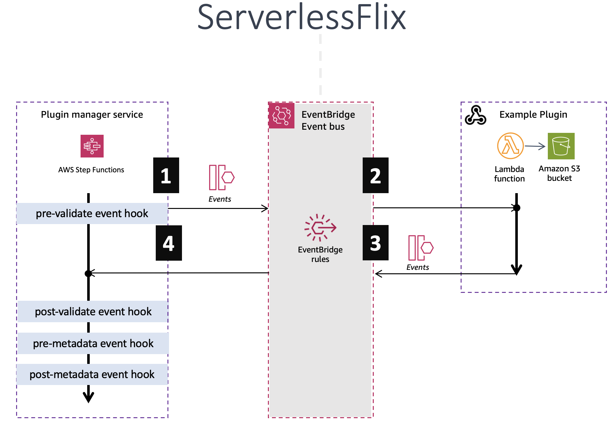

# Adding Plugins to serverlessVideo

serverlessVideo is an event-driven extensible serverless application that allows you to hook into various lifecycle events. You can add custom plugins to enhance the functionality of the application.

## Creating a Plugin for serverlessVideo

EventBridge events are raised throughout a plugin processing lifecycle. You can hook into these events with custom plugins to start custom workloads.

### Hooking into Lifecycle Events:

Plugins are "triggered" by a webhook lifecycle event. Events are emitted by the plugin manager microservice (using EventBridge).

#### 1. Hooking into Lifecycle Events:

Every plugin must hook into at least one of the available lifecycle events. Currently, the supported events are:

- `preValidate` - Use this hook to start plugins that validate a video broadcast is appropriate for onDemand playback.
- `postValidate` - This hook runs after preValidation has occurred, and has access to `valid:false` or `valid:true`
- `preMetadata` - Use this hook to generate metadata for a given video.
- `postMetadata` - Use this hook to generate or act upon video metadata that is generated by the previous hook.

These events occur synchronously. The "preValidate" event hook executes first, followed by the "postValidate" event hook, and so on.

---

#### 2. Triggering your plugin

To trigger your plugin, your plugin template must include an EventBridge rule that looks like the following example where `{hook}` is the name of the event hook you want to register for on of (`preMetadata`, `postMetadata`, or `preValidate`, or `postValidate`), and `{your-plugin-name}` is the name of you plugin:

```yml
Pattern:
  source:
    - serverlessVideo.pluginManager
  detail-type:
    - {hook}.{your-plugin-name}
```

**Example**
If your plugin was called `exampleplugin` and you wanted it to run on the `pre-validate` lifecycle event, then you can trigger your plugin by creating the following EventBridge rule:

```yml
Pattern:
  source:
    - serverlessVideo.pluginManager
  detail-type:
    - preValidate.example_plugin
```

---

#### 3. Returning a response from your plugin

Upon triggering, your plugin will receive a payload that contains a task token. It is essential to return this task token along with any outputs you generate. Do this by emitting an event on the default event bus in the following format:

```json
{
  "Detail": {
    "Message": {
      "{your-plugin-outputs}"
    },
    "TaskToken": "{tasktoken-you-received}"
  },
  "DetailType": "plugin-complete",
  "EventBusName": "default",
  "Source": "serverlessVideo.plugin.{your-plugin-name}"
}
```

Once the task token is received, it is routed back to the plugin manager service along with any other data added to the event payload. this is then passed on to the next event lifecycle webhook and persisted to a central DynamoDB table.



By following these guidelines, you can seamlessly integrate your plugin into serverlessVideo and enrich the video streaming experience.

---

## How to Add a Plugin

An [example plugin](../templates/plugin_template) is located in the `template` directory.

To add a custom plugin to serverlessVideo, follow these steps:

1. Fork this repository
1. Create a new folder for your plugin inside the `plugins` directory in the root of the project.
1. Create a plugin registration file named `plugin.JSON` Here's an example of how a JSON plugin registration file might look like:

```JSON
{
  "name": "MyPlugin",
  "description": "A custom plugin that validates a video is longer than 10 seconds",
  "author": "Jane Doe",
  "version": "1.0.0",
  "tags": ["video", "streaming", "AWS", "serverless"],
  "eventHook": "preValidate",
  "average_completion_time": "10s",
  "services":["StepFunctions","API Gateway","Lambda"],
  "deployment_template":"template.yaml",
  "output_example":{
            "valid":"BOOL"
  }
}
```

Explanation of the fields:

- `name`: The name of the plugin.
- `description`: A brief description of what the plugin does.
- `author`: The name or contact information of the author/developer of the plugin.
- `version`: The version number of the plugin.
- `tags`: An array of relevant tags to help categorize the plugin.
- `eventHook`: The specific event hook that the plugin needs to be registered for (e.g., "metadata" or "validation").
- `average_completion_time`: How long does you plugin take to complete?
- `services`: What services does your plugin use?
- `deployment_template`: The location of your IaC deployment template
- `output_example`: An example of the output produced by the plugin.

3. Inside the plugin folder, create a new file named `README.md` to document how to use, test and deploy your plugin.

4. Make a pull request to the repository.

## Plugin Structure

A typical plugin for serverlessVideo should have the following structure:

```
plugins/
  └── my-custom-plugin/
      └── template.yaml
      └── plugin.json
      └── README.md
      └── functions
        └── app.js
```

## Plugin event payload

The event object that your plugin receives depends on which event hook it is triggered by, all event hooks contains information about the video generated by the video stream, and will also contain data from any plugins that were ran by a preceding event hook. use the `playbackURL` field to download the video to an S3 bucket for further processing, as seen in this [example plugin](https://github.com/aws-samples/serverless-video-streaming/blob/main/plugins/3-premetadata-plugins/transcribe_plugin/functions/app.js).


**Payload examples for each plugin cycle:**

- [preValidate Event Documentation](../events/prevalidate-event.md)
- [postValidate Event Documentation](../events/postvalidate-event.md)
- [preMetadata Event Documentation](../events/premetadata-event.md)
- [postMetadata Event Documentation](../events/postmetadata-event.md)

---

### Additional input object data

As each event hook populates from plugin data, the response is passed along the eventhook workflow and appended to the `pluginData` Key.

This means that all of the plugin response data is available to the final hook (postMetadata):
- [preValidate Event Documentation](../events/prevalidate-event.md)
- [postValidate Event Documentation](../events/postvalidate-event.md)
- [preMetadata Event Documentation](../events/premetadata-event.md)
- [postMetadata Event Documentation](../events/postmetadata-event.md)


## Plugin response object

Your plugin must emit an event to the default event bus. The event must contain the original task token, and any outputs generated by your plugin, using the following event format:

```json
{
  "Detail": {
    "Message": {
      "{your-plugin-outputs}"
    },
    "TaskToken": "{tasktoken-you-received}"
  },
  "DetailType": "plugin-complete",
  "EventBusName": "default",
  "Source": "serverlessVideo.plugin.{your-plugin-name}"
}
```

If you plugin is registered for a validation event hook, it must return:

```JSON
  {
    "valid": "BOOL",
    "reason": "STRING" //optional
  }
```

If the plugin is registered for a metadata event hook, it can return a comma separated array of tags, or a plugin data object:

```JSON
{
  "tags": [],
  "pluginData": {
    "transcript": "...."
  }
```

For example, the [/plugins/3-premetadata-plugins/transcribe_plugin](/plugins/3-premetadata-plugins/transcribe_plugin), returns a transcript of the video. The final event it emits looks as follows:

```JSON
{
     "Detail": {
       "Message": {
         "pluginData": {
              "transcript": "hello and welcome to my video about....."
            }
       },
       "TaskToken": "ASDFGHJK1234567890"
     },
     "DetailType": "plugin-complete",
     "EventBusName": "default",
     "Source": "serverlessVideo.plugin.transcriptPlugin"
   }
```

## Shared S3 bucket

AWS Lambda and AWS Step Functions have the following permissions allocated for the central core bucket that all on-demand videos are persisted to:
```json
    "s3:ListBucket",
    "s3:GetObject",
    "s3:PutObject"
```
* The bucket name is `serverlessVideo-basecore-cdnstack-p6b-originbucket-qf6cyql0kb4m`
* This bucket is an origin for the applications's CloudFront domain. Anything persisted here is publicly readable,
* Use this bucket to persist larger plugin files to such as, translations, subtitles, and media files.  
* Your plugin should then return a pointer the relevant file location.


## Testing your plugin

Once you have built your plugin in your own aws account, and created an Amazon EventBridge rule with your plugin as the target, you can test it by deploying and running the [serverlessVideo plugin tester](/plugins/plugin_tester).
.

Alternatively you can place an event onto the default event bus with the following CLI command:

```bash
aws events put-events --entries file://event.json
```

Use the example [event.json](//templates/plugin_template/event.json) file in the [plugin_template](/templates/plugin_template) folder as an example.

## Example Plugin Code

There is an example plugin located in the [/plugins/3-premetadata-plugins/transcribe_plugin](/plugins/3-premetadata-plugins/transcribe_plugin) directory. This plugin downloads an mp4 version of a video stream, and persists the file to an S3 bucket. It then transcribes the audio and returns the results. The plugin is registered for the `pre-metadata` event hook.

## Write automated tests for your plugin

serverlessVideo contains an automating testing framework that you can
use to configure and run unit and integration tests. We encourage you 
to write automated tests for your plugin. Your tests will increase the 
resilience of your code by ensuring that new changes introduced to the 
codebase do not break your existing fuctionality.

Your automated tests can be integrated into the serverlessVideo test suite,
which is run as an automatic check for each GitHub Pull Request.  

To learn how to write automated tests and integrate them into our test suite,
please view the [Test Plugin](../plugins/1-prevalidate-plugins/test-prevalidate-plugin/README.md).

## Limitations

**Time Limit:**
Your plugin must return a task token within 30 seconds. If it takes longer, the plugin manager will move on to the next task.

**Payload limits **
The maximum plugin response size is 20kb. If the plugin produces outputs larger than this, save the outputs to an S3 bucket and return the pointer.

## Conclusion

By following these steps, you can add custom plugins to serverlessVideo and extend its functionality.
If you have any questions or need further assistance, please don't hesitate to reach out to our team or refer to the official documentation.

Happy coding!

---
